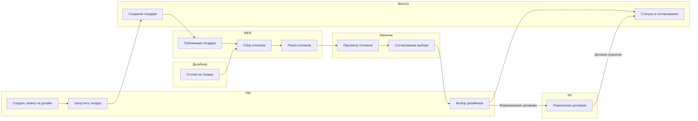
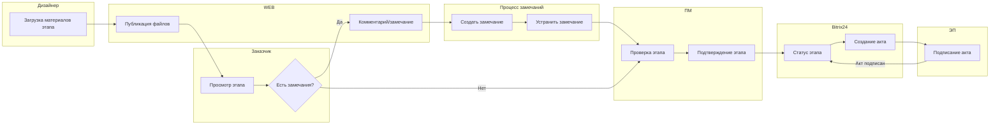
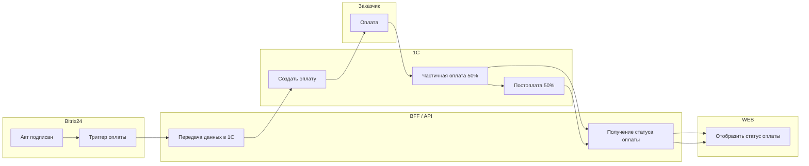

# BPMN/статусные диаграммы (МВП)

Ниже три ключевых процесса МВП в формате Mermaid (flowchart).

## 1) Тендер дизайнера → выбор → договор

## 2) Дизайн‑этап → акт → приёмка

## 3) Оплата по акту → синхронизация с 1С

