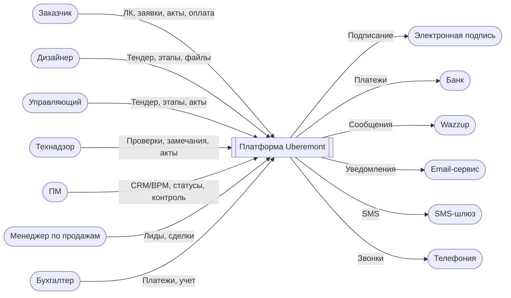

# Диаграммы C4 (контекст и контейнеры)


Ниже представлены две диаграммы в формате Mermaid.


## 1) Контекстная диаграмма (C4 Level 1)




## 2) Контейнерная диаграмма (C4 Level 2)

```mermaid

flowchart LR

  subgraph Cloud["Облако"]

    WEB["WEB UI (Next.js)"]

    BFF["BFF / API (Laravel/CURSOR)"]

    WEBDB[(WEB БД)]

  end


  subgraph OnPrem["On‑prem"]

    BITRIX["Bitrix24 (CRM/BPM)"]

    DISK["Bitrix.Диск (файлы)"]

    ERP["1С (ERP/Бухгалтерия/Склад)"]

  end


  subgraph External["Внешние системы"]

    ESIGN2["Электронная подпись"]

    BANK2["Банк"]

    WAZZUP2["Wazzup"]

    EMAIL2["Email‑сервис"]

    SMS2["SMS‑шлюз"]

    TEL2["Телефония"]

  end


  WEB <--> BFF:::api

  BFF <--> BITRIX:::api

  BFF <--> ERP:::api

  BFF --> WEBDB:::data


  BITRIX --> DISK:::data

  WEB -->|Прямые ссылки (МВП)| DISK


  BFF --> ESIGN2:::ext

  BFF --> BANK2:::ext

  BFF --> WAZZUP2:::ext

  BFF --> EMAIL2:::ext

  BFF --> SMS2:::ext

  BFF --> TEL2:::ext


  classDef api fill:#E8F2FF,stroke:#7AA7FF,color:#003366;

  classDef data fill:#F3F7F3,stroke:#7FB57F,color:#244D24;

  classDef ext fill:#FFF4E6,stroke:#FFB366,color:#663300;

```


Cloud agents require code storage to function properly. Your current privacy mode prevents this. Your privacy mode is enforced by your team admin. Please contact them to change privacy settings.
