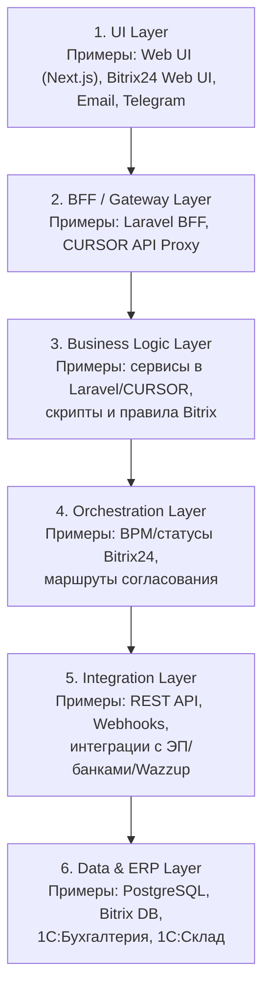

# Диаграмма слоистой архитектуры

Цель: отразить 6 логических слоёв архитектуры, уровни взаимодействий и примеры
реализации.

```mermaid
flowchart TB
  L1["1. UI Layer\nПримеры: Web UI (Next.js), Bitrix24 Web UI, Email, Telegram"]
  L2["2. BFF / Gateway Layer\nПримеры: Laravel BFF, CURSOR API Proxy"]
  L3["3. Business Logic Layer\nПримеры: сервисы в Laravel/CURSOR,\nскрипты и правила Bitrix"]
  L4["4. Orchestration Layer\nПримеры: BPM/статусы Bitrix24,\nмаршруты согласования"]
  L5["5. Integration Layer\nПримеры: REST API, Webhooks,\nинтеграции с ЭП/банками/Wazzup"]
  L6["6. Data & ERP Layer\nПримеры: PostgreSQL, Bitrix DB,\n1С:Бухгалтерия, 1С:Склад"]

  L1 --> L2 --> L3 --> L4 --> L5 --> L6
```
