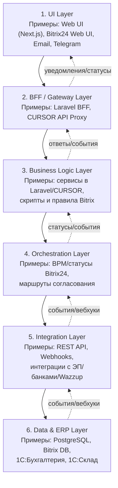

# Диаграмма слоистой архитектуры

Цель: отразить 6 логических слоёв архитектуры, уровни взаимодействий и примеры
реализации.

## Таблица соответствий «слой → компонент»
| Слой | Назначение | Примеры реализации |
| --- | --- | --- |
| 1. UI Layer | Взаимодействие пользователей | Web UI (Next.js), Bitrix24 UI, Email, Telegram |
| 2. BFF / Gateway | Агрегация и защита API | Laravel BFF, CURSOR API Proxy |
| 3. Business Logic | Бизнес‑правила и вычисления | Сервисы Laravel/CURSOR, правила Bitrix |
| 4. Orchestration | Статусы и маршруты | BPM/статусы Bitrix24, маршруты согласования |
| 5. Integration | Обмен с внешними системами | REST API, Webhooks, ЭП/банк/Wazzup |
| 6. Data & ERP | Данные и учет | PostgreSQL, Bitrix DB, 1С:Бухгалтерия, 1С:Склад |
